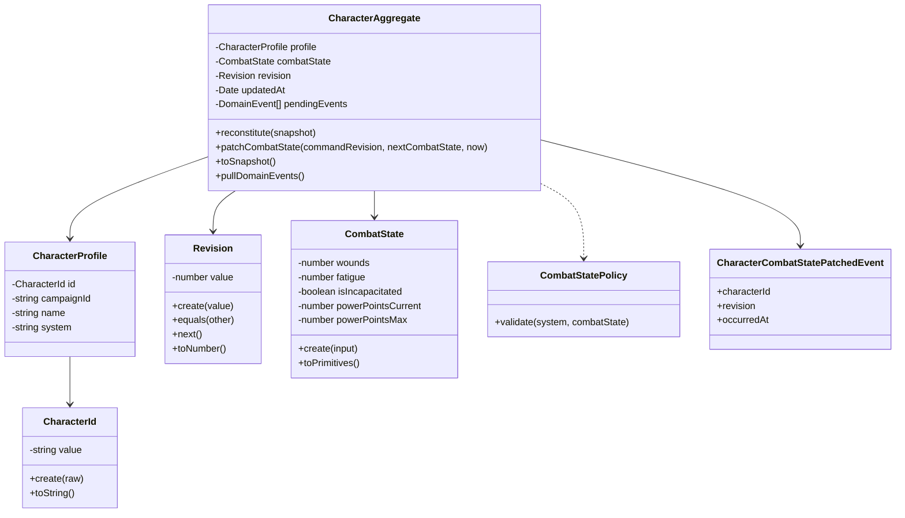

# Character Bounded Context (Backend)

## Ubiquitous Language (RPG)

- `Personagem`: protagonista controlado por jogador dentro de uma campanha.
- `Estado de Combate`: estado operacional usado em cena (ferimentos, fadiga, incapacitado, pontos de poder).
- `Ferimentos`: trilha de dano fisico (`0..3` em Savage Pathfinder).
- `Fadiga`: trilha de exaustao (`0..2` em Savage Pathfinder).
- `Pontos de Poder`: recurso de conjuracao (`current <= max`).
- `Revisao`: versao otimista do agregado para evitar sobrescrita concorrente.
- `Conflito de Revisao`: tentativa de atualizar com revisao antiga.
- `Snapshot`: representacao serializavel do agregado para persistencia/transporte.

## Modelo de Dominio (Mermaid)

## Invariantes protegidos

- Revisao deve ser inteiro nao-negativo.
- Patch de combate so aceita revisao igual a revisao atual do agregado.
- `powerPointsCurrent` deve ser inteiro nao-negativo e `<= powerPointsMax`.
- Em `savage_pathfinder`: `wounds` em `0..3` e `fatigue` em `0..2`.
