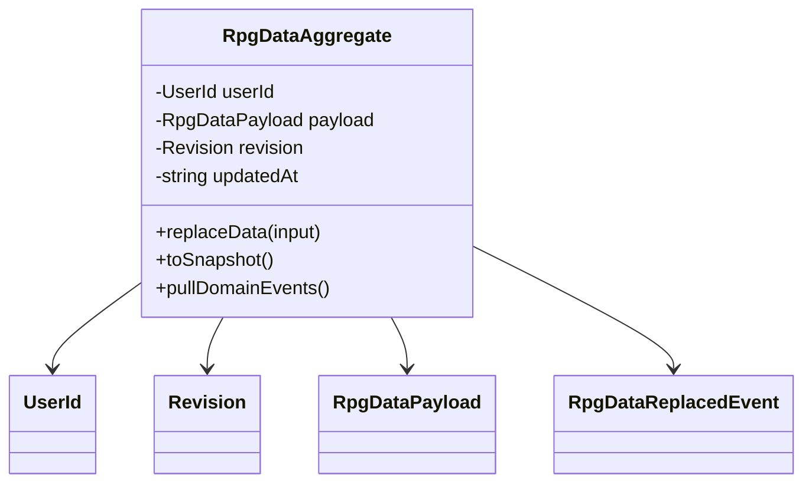

# RPGData Bounded Context

## Ubiquitous Language
- **RPGData**: conjunto versionado de dados do usuario para campanha, personagens, sessoes e notas.
- **Revision**: versao inteira usada para controle otimista de concorrencia.
- **Payload V1**: formato canonical dos dados sincronizados pelo frontend.
- **Replace Data**: operacao de substituicao atomica do payload.
- **Seed**: estado inicial criado quando o usuario ainda nao possui dados.

## Modelo de Dominio (Mermaid)

## Invariantes Protegidos
- `userId` nao pode ser vazio.
- `revision` deve ser inteiro nao negativo.
- `replaceData` exige `revision` igual a revisao atual do agregado.
- `payload` deve obedecer schema `version: 1` com `campaign/characters/sessions/notes`.

